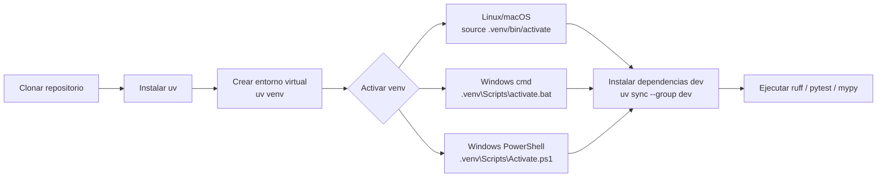

# Python para Desarrolladores C#

Curso práctico de Python orientado a desarrolladores con experiencia en C# y .NET. Cada módulo establece puentes explícitos entre los conceptos que ya conoces y su equivalente en Python.

## Prerrequisitos

- Experiencia en C# y .NET (cualquier versión)
- Conocimientos básicos de POO
- Familiaridad con la línea de comandos

## Instalación del entorno

Instala `uv` (gestor de paquetes moderno, equivalente al `dotnet` CLI):

```bash
# Linux / macOS
curl -LsSf https://astral.sh/uv/install.sh | sh

# Windows (PowerShell)
powershell -ExecutionPolicy ByPass -c "irm https://astral.sh/uv/install.ps1 | iex"
```

Crea el entorno virtual del curso:

```bash
uv venv
```

Actívalo según tu sistema operativo:

```powershell
# Windows (PowerShell)
.venv\Scripts\Activate.ps1
```

```cmd
:: Windows (cmd)
.venv\Scripts\activate.bat
```

```bash
# Linux / macOS
source .venv/bin/activate
```

### Flujo visual



## Mapa del curso

| Módulo | Tema | Equivalente C# |
|--------|------|----------------|
| 01 | [Fundamentos](./modulo-01-fundamentos/) | Variables, tipos, control de flujo |
| 02 | [Estructuras de datos](./modulo-02-estructuras/) | Colecciones, LINQ |
| 03 | [Funciones avanzadas](./modulo-03-funciones/) | Delegates, Func, lambdas |
| 04 | [POO](./modulo-04-poo/) | Clases, interfaces, herencia |
| 05 | [Archivos y serialización](./modulo-05-archivos/) | Streams, System.Text.Json |
| 06 | [Async/await](./modulo-06-async/) | Task, async/await en .NET |
| 07 | [Testing con pytest](./modulo-07-testing/) | xUnit, NUnit, Moq |
| 08 | [Packaging y distribución](./modulo-08-packaging/) | NuGet, dotnet publish |

## Proyecto del curso

A lo largo del curso construirás una **CLI de análisis de logs** que lee ficheros de log, los parsea, filtra y genera un resumen. Cada módulo añade funcionalidad nueva usando los conceptos aprendidos.

## Convenciones del curso

- 🔵 **C#** — bloque de código equivalente en C#
- 🐍 **Python** — bloque de código Python
- ⚠️ **Trampa común** — diferencia que suele confundir a devs C#
- ✅ **Ejercicio** — práctica propuesta

## Cómo contribuir

¡Las contribuciones son bienvenidas! Para mantener la calidad del material, **todo cambio debe llegar a `main` a través de una Pull Request** — los pushes directos están desactivados.

### Pasos

1. Haz fork del repositorio
2. Crea una rama descriptiva desde `main`:
   ```bash
   git checkout -b fix/modulo-03-typo
   # o
   git checkout -b feat/modulo-05-nuevo-ejercicio
   ```
3. Realiza tus cambios y escribe un commit claro
4. Abre una Pull Request hacia `main` con una descripción del cambio
5. Espera la revisión antes del merge

### Qué tipos de contribuciones se aceptan

- 🐛 Correcciones de errores en el código de los ejemplos
- 📝 Mejoras en las explicaciones o comparativas C#/Python
- ➕ Nuevos ejercicios o soluciones alternativas
- 🌐 Traducciones (si el curso se expande a otros idiomas)

### Convención de ramas

| Prefijo | Uso |
|---------|-----|
| `fix/` | Correcciones de errores o typos |
| `feat/` | Nuevo contenido o ejercicios |
| `docs/` | Cambios solo en documentación |
| `refactor/` | Reorganización sin cambio de contenido |

## Licencia

Este repositorio combina código y material docente, cada uno con su licencia:

- **Código** (ejercicios, soluciones, proyecto hilo) — [MIT](./LICENSE).
- **Contenido** (READMEs, explicaciones) — [CC BY 4.0](./LICENSE-CONTENT).

Puedes reutilizar y adaptar el material citando la fuente.
